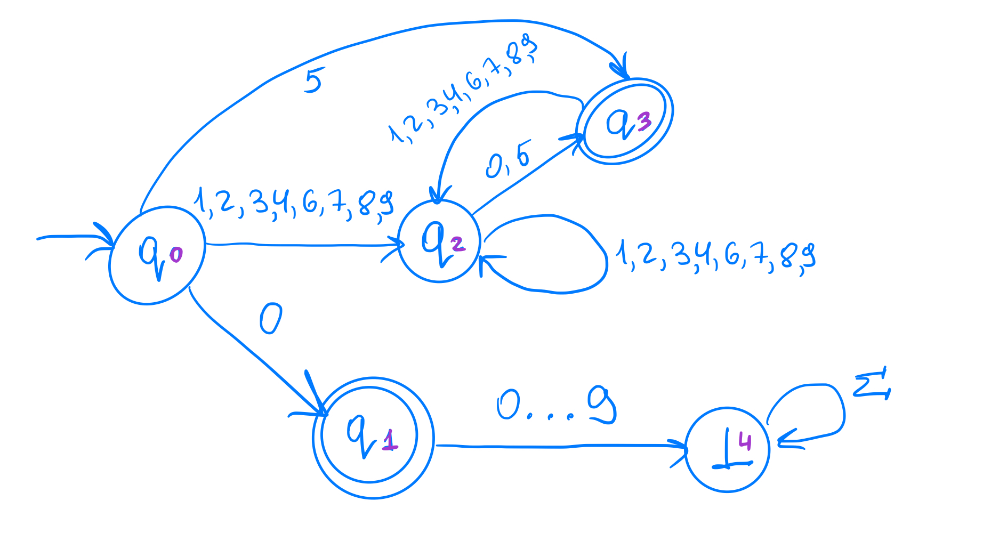
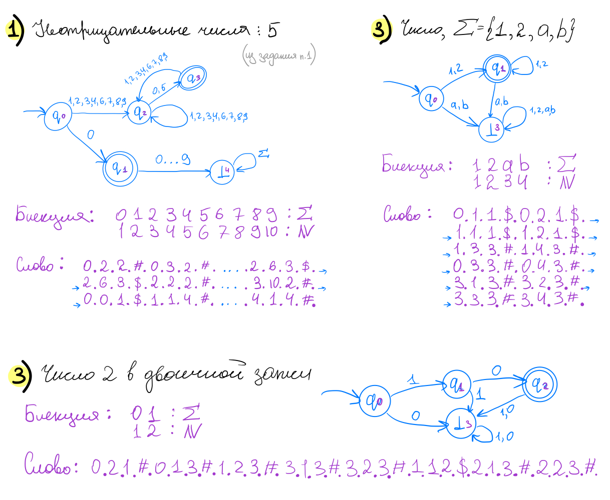

# Задание 1

#### Построить полный конечный детерминированный автомат, распознающий язык неотрицательных чисел без лидирующих нулей, делящихся на 5.

  Решение:  Полученный граф имеет 5 состояний.

# Задание 2

#### Построить полный конечный детерминированный автомат, распознающий язык строк над алфавитом `{a, b}`, в которых букв `a` не меньше 3, а букв `b` не больше 2.

  Решение:  Полученный граф имеет 13 состояний.

# Задание 3

#### Найти документацию вашего второго самого любимого языка программирования. Найти особенности лексического синтаксиса, о которых вы раньше не знали. В отчете описать особенности и привести ссылку на спецификацию.

  Я знаю на данный момент 3 языка программирования, каждый из них мы успели пройти в первом курсе. Cpp, Python, Bash. В отчете я опишу особенности лексического синтаксиса языка Python. Документацию по нему можно найти [тут](https://docs.python.org/3/).

  **1) Dictionary Merge**

В языке Python есть оператор, который позволяет сливать два словаря.

```python
    >>> x = {"key1": "value1 from x", "key2": "value2 from x"}
    >>> y = {"key2": "value2 from y", "key3": "value3 from y"}
    >>> x | y
    {'key1': 'value1 from x', 'key2': 'value2 from y', 'key3': 'value3 from y'}
    >>> y | x
    {'key2': 'value2 from x', 'key3': 'value3 from y', 'key1': 'value1 from x'}
```

  **2) Pattern Matching**

[Match-case](https://www.python.org/dev/peps/pep-0636/), похож на switch-case в других языках.

```python
    match command.split():
    case ["quit"]:
        print("Goodbye!")
        quit_game()
    case ["look"]:
        current_room.describe()
    case ["get", obj]:
        character.get(obj, current_room)
    case ["go", direction]:
        current_room = current_room.neighbor(direction)
```

 **3) All, any**

Функция any возвращает значение True, если хотя бы одно из переданных утверждений верно, all – в случае, если все верны. На мой взгляд, эти две функции заслуживают отдельного внимания всего лишь из-за их простоты в использовании.

```python
    >>> print(all([2 == 2, 3 == 2]))
    False
    >>> print(all([2 > 1, 3 != 4]))
    True
    >>> print(any([True, False, False]))
    True
    >>> print(any([False, False]))
    False
```

  **4) Моржовый оператор (Walrus Operator)**

Присваивания с помощью моржа требуется делать в круглых скобках, и перед знаком равно пишется двоеточие. Внутри скобок либо создается новая переменная, либо происходит присвоение значения уже существующий переменной. Но фишка заключается в том, что вся эта конструкция, скажем так, возвращает присвоенное значение, как это делают обычные функции.

```python
      # так нам не нужно писать для присваивания лишнюю строчку
      if (n := len(a)) > 10:
        print(f'Слишком много элементов, а именно {n}')
```

  **5) Корутины (Coroutines)**

В PEP 342 были представлены [корутины](https://docs.python.org/3/library/asyncio-task.html), которые стали некой противоположностью генераторов.

```python
    >>> def double():
    ...     print('> Начало функции')
    ...     value = 2 * (yield)
    ...     print('> value = {}'.format(value))
    ...     yield value
    ...     print('> Конец функции')
    >>> d = double()
    >>> next(d)
    > Начало функции
    >>> d.send(21)  # метод send объекта генератора передает данные в функцию
    > value = 42
    42
    >>> d.send(42)
    > Конец функции
    Traceback (most recent call last):
      File "<stdin>", line 1, in <module>
    StopIteration
```

# Задание 4

#### Придумать язык для описания конечных автоматов. Привести описание этого языка на естественном языке. Привести три файла, описывающих какие-нибудь автоматы на вашем языке.

  Пусть автомат - это ориентированный граф. И в нашем языке словом будет граф. Теперь нужно придумать, как закодировать граф в слово. Скажем, что в слове содержится описание каждого ребра. Пусть слово состоит из 4 сущностей (будем также ставить точку в конце каждой сущности):

-   `Число`, отвечающее за вершину, из которой выходит ребро.
-   `Число`, отвечающее за то, по чему мы совершаем переход. То есть в КДА на ребра записано что-то из алфавита. Поскольку алфавит это конечное множество, то мы можем составить биекцию между префиксом ряда натуральных чисел и алфавитом. Таким образом мы можем заранее знать, как именно выглядит эта вторая сущность в нашем алфавите для описания КДА. (Очевидно, что если переход осуществляется по нескольким символам алфавита КДА, то мы просто описываем несколько ребер с одинаковым in и out, но разной второй сущностью)
-   `Число`, отвечающее за вершину, в которую выходит ребро.
-   `$` - если это состояние терминальное и `#` в обратном случае.

    Приведем несколько автоматов, которые опишем новым языком: 

===================== ИСПРАВЛЕНИЕ

  Для начала будем передавать наш алфавит. После каждого символа, написанного в скобках, через стрелочку и пробелы биективное отображение в натуральное число, это всё будет разделено запятой. Далее пустая строка. Далее через запятую начальные вершины.
  Далее будем предавать строчку, кодирующую наш ориентированный граф по описанному выше правилу. Единственное, для удобства чтения будем писать каждое ребро на новой строке.
  Перепишем теперь последний пример из картинки выше:

  ```
  "0" -> 1, "1" -> 2

  0

  0.2.1.#.
  0.1.3.#.
  1.2.3.#.
  3.1.3.#.
  3.2.3.#.
  1.1.2.$.
  2.1.3.#.
  2.2.3.#.
  ```

# Задание 5

#### Подсветить какие-нибудь особенности лексического синтаксиса в среде разработки. В отчете указать, что вы хотели подсветить и как.

  Я решила сделать подсветку синтаксиса языка python для среды разработки Atom на MacOS. После несколький часов поиска шаблона, я нашла специальный пакет, который позволяет выделять заданные слова в зависимости от расширения файла. [Базовый пакет можно скачать тут.](https://github.com/BlueSilverCat/highlight-registered-keyword)
  В первую очердь нужно было создать [CSON file](sample-config.cson) и прописать путь к нему в настройках пакета. В этом файле хранятся данные о ключевых словах. Далее нужно было создать [styles.less file](highlight-registered-keyword.less), куда можно было записать, каким цветом будут выделяться ключеные слова из первого файлика.
  Таким образом получился данный результат: 

  К сожалению, результат не идеален. В данном виде пакет не дает возможности сделать подсветку самих букв, также нет поддержки любых регулярных выражения =(
