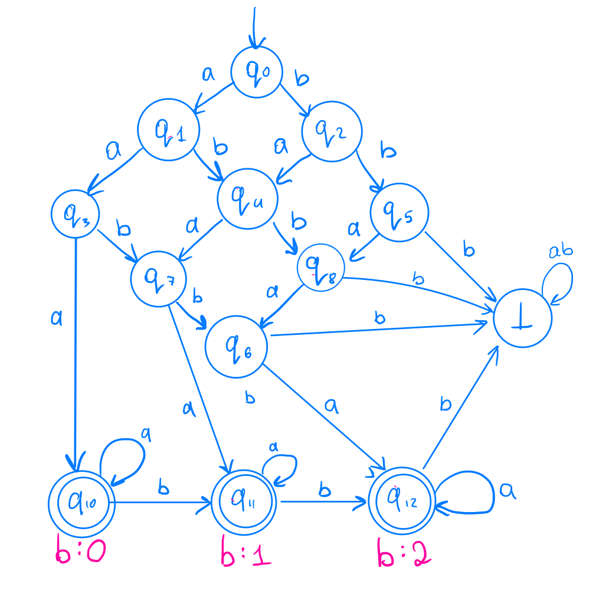
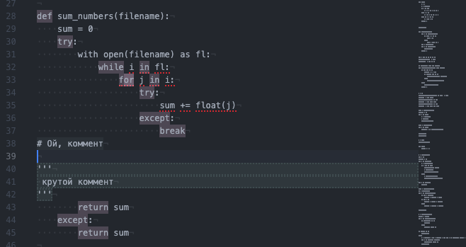

# Задание 1
#### Построить полный конечный детерминированный автомат, распознающий язык неотрицательных чисел без лидирующих нулей, делящихся на 5.

  Решение:  Полученный граф имеет 5 состояний.

# Задание 2
#### Построить полный конечный детерминированный автомат, распознающий язык строк над алфавитом `{a, b}`, в которых букв `a` не меньше 3, а букв `b` не больше 2.

  Решение:  Полученный граф имеет 13 состояний.

# Задание 3
#### Найти документацию вашего второго самого любимого языка программирования. Найти особенности лексического синтаксиса, о которых вы раньше не знали. В отчете описать особенности и привести ссылку на спецификацию.

# Задание 4
#### Придумать язык для описания конечных автоматов. Привести описание этого языка на естественном языке. Привести три файла, описывающих какие-нибудь автоматы на вашем языке.

  Пусть автомат - это ориентированный граф. И в нашем языке словом будет граф. Теперь нужно придумать, как закодировать граф в слово. Скажем, что в слове содержится описание каждого ребра. Пусть слово состоит из 4 сущностей (будем также ставить точку в конце каждой сущности):
  * `Число`, отвечающее за вершину, из которой выходит ребро.
  * `Число`, отвечающее за то, по чему мы совершаем переход. То есть в КДА на ребра записано что-то из алфавита. Поскольку алфавит это конечное множество, то мы можем составить биекцию между префиксом ряда натуральных чисел и алфавитом. Таким образом мы можем заранее знать, как именно выглядит эта вторая сущность в нашем алфавите для описания КДА. (Очевидно, что если переход осуществляется по нескольким символам алфавита КДА, то мы просто описываем несколько ребер с одинаковым in и out, но разной второй сущностью)
  * `Число`, отвечающее за вершину, в которую выходит ребро.
  * `$` - если это состояние терминальное и `#` в обратном случае.

  Приведем несколько автоматов, которые опишем новым языком: 

# Задание 5
#### Подсветить какие-нибудь особенности лексического синтаксиса в среде разработки. В отчете указать, что вы хотели подсветить и как.

  Я решила сделать подсветку синтаксиса языка python для среды разработки Atom на MacOS. После несколький часов поиска шаблона, я нашла специальный пакет, который позволяет выделять заданные слова в зависимости от расширения файла. [Базовый пакет можно скачать тут.](https://github.com/BlueSilverCat/highlight-registered-keyword)
  В первую очердь нужно было создать [CSON file](sample-config.cson) и прописать путь к нему в настройках пакета. В этом файле хранятся данные о ключевых словах. Далее нужно было создать [styles.less file](highlight-registered-keyword-), куда можно было записать, каким цветом будут выделяться ключеные слова из первого файлика.
  Таким образом получился данный результат: 
